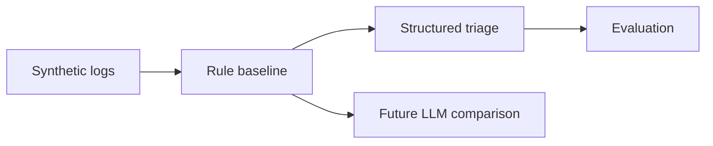

# AI Log Triage Lab

Independent public portfolio project for **Python**, **deterministic classification**, **structured outputs** and future **LLM comparison**.

This repository was created from scratch with synthetic logs. It does not contain corporate code, real data, private endpoints, credentials, logs or proprietary rules.

## Problem

Operational logs need triage into categories, severity and suggested actions. Before adding LLMs, the project needs a measurable baseline.

## What It Demonstrates

- `LogEntry` input model.
- `TriageResult` structured output.
- `Severity`, `Category` and `SuggestedAction` enums.
- Deterministic rule baseline.
- Synthetic labeled dataset.
- Basic evaluation with labeled cases, correct cases and accuracy.

## Architecture



See [docs/architecture.md](docs/architecture.md) for details.

## Stack

`Python` `JSONL` `Enums` `Dataclasses` `Structured output` `PyTest`

## Run Locally

```powershell
python -m pip install -e .
python examples/run_demo.py
```

## Run Tests

```powershell
python -m pip install -e ".[dev]"
pytest
```

## Technical Decisions

- No LLM is added in v0.2.0 because the project first needs a baseline and evaluation.
- The labeled dataset is synthetic and small enough to inspect manually.
- Future LLM work should compare against the baseline using the same cases.

## Roadmap

- Add more labeled synthetic logs.
- Add confusion matrix style reporting.
- Add Ollama/LLM comparison after the applied AI study phase.

## Security and Independence

See [SECURITY.md](SECURITY.md) and [DISCLAIMER.md](DISCLAIMER.md).
