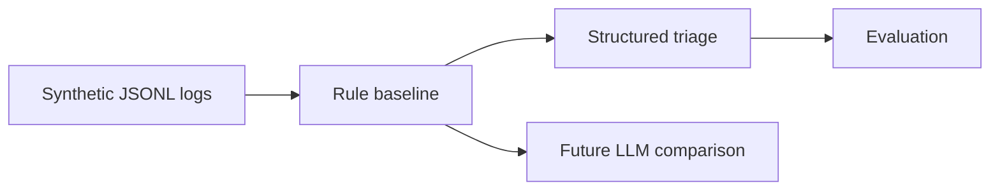

# AI Log Triage Lab

[](https://github.com/guilherme-lacerda-tech/ai-log-triage-lab/actions/workflows/ci.yml)

[](https://github.com/guilherme-lacerda-tech/ai-log-triage-lab/releases)
[](LICENSE)

Synthetic log triage lab with an explainable deterministic baseline and future room for LLM comparison.

## Why / Problem

Before applying an LLM to log triage, there should be a baseline that is structured, explainable and measurable. This project builds that baseline with synthetic logs.

## Features

- `LogEntry` input model.
- `TriageResult` structured output.
- `Severity`, `Category` and `SuggestedAction` enums.
- Deterministic classification rules.
- Synthetic labeled dataset.
- Basic evaluation with labeled cases, correct cases and accuracy.
- CI with Ruff, PyTest and coverage.

## Architecture



## Tech Stack

Current: `Python` `JSONL` `Dataclasses` `Enums` `Structured output` `PyTest` `Ruff`

Planned: larger labeled dataset, confusion-matrix style reporting and Ollama/LLM comparison after the applied AI study phase.

## Quick Start

```powershell
python -m pip install -e ".[dev]"
python examples/run_demo.py
```

## Tests

```powershell
python -m pytest --cov --cov-report=term-missing
python -m ruff check .
```

## Example Output

```text
Logs triaged: 5
First category: operational_delay
```

## Project Structure

- `src/ai_log_triage_lab/triage.py`: baseline, result types and evaluation.
- `data/sample/synthetic_logs.jsonl`: labeled synthetic logs.
- `tests`: category, evaluation and output tests.

## Engineering Decisions

- No LLM is added yet because this version is about a measurable baseline.
- Future LLM work should compare against the same labeled cases.
- The dataset is synthetic and intentionally inspectable.

## Roadmap

See [ROADMAP.md](ROADMAP.md).

## Security

No real logs, credentials, endpoints, hostnames, client data or employer identifiers are included.
