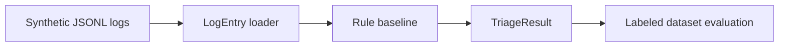

# Architecture

## Design Goal

Build an AI-ready log triage lab by first creating a deterministic, explainable baseline on synthetic logs.

## Flow

## Future LLM Comparison

The deterministic baseline is the first comparison target. A future LLM or Ollama implementation should be evaluated against the same labeled dataset instead of replacing the baseline without evidence.
